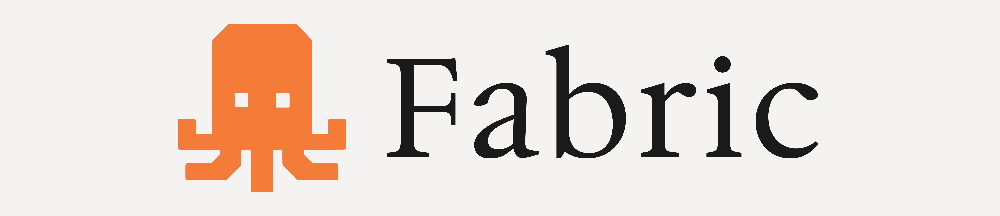

# Fabric

Fabric is a local automation workspace for workflows, forms, webhooks, pages,
plugins and agent tools.

Build visual workflows, publish public forms and webhooks, connect plugins, run
agent chats, and keep the whole workspace local unless you choose to expose it
through a Public URL.

```bash
npx @auvexis/fabric@alpha
```

> [!IMPORTANT]
> Fabric is currently alpha software. Expect breaking changes while the project
> evolves toward a stable public release.


## Why Fabric

Automation tools usually split local editing, public webhooks, forms, agents,
plugin integrations, and deployment into separate products or cloud-first
services.

Fabric brings those pieces into one local-first workspace that can run from npm,
Docker, or Desktop.

> [!TIP]
> Use Fabric locally by default, then set a Public URL when forms, webhooks,
> OAuth callbacks, or another device need to reach your workspace.


## Highlights

- Visual workflow editor with nodes, triggers, variables, panels, and timeline.
- Public forms and webhooks through a configurable Public URL.
- Agent workflows with chat sessions and plugin-backed tools.
- Pages and website editor foundation.
- Plugin architecture powered by Fabric SDK manifests.
- Desktop app with native windows, tray support, restart flows, and update checks.
- Production Docker gateway with a single exposed entrypoint.
- npm runner for local use without cloning the repository.


## Quick Start

Requires Node.js 22 or newer.

```bash
npx @auvexis/fabric@alpha
```

Open:

```text
http://localhost:23800
```

Fabric starts these local services:

| Service | URL |
| --- | --- |
| Gateway | `http://localhost:23800` |
| API | `http://localhost:23801` |
| Client | `http://localhost:23802` |

Open only the gateway URL in normal use.


## Docker

Requires Docker Desktop or Docker Engine.

```bash
FABRIC_VERSION=0.1.0-alpha.14 docker compose -f docker-compose.prod.yml up -d
```

PowerShell:

```powershell
$env:FABRIC_VERSION = "0.1.0-alpha.14"
docker compose -f docker-compose.prod.yml up -d
```

Open:

```text
http://localhost:23800
```

Stop:

```bash
docker compose -f docker-compose.prod.yml down
```


## Desktop

Desktop builds are published from GitHub releases during alpha.

Expected release assets:

- Windows: `Fabric-<version>-win-x64.exe`
- macOS: `Fabric-<version>-mac-x64.dmg`
- macOS Apple Silicon: `Fabric-<version>-mac-arm64.dmg`
- Linux AppImage: `Fabric-<version>-linux-x64.AppImage`
- Linux deb: `Fabric-<version>-linux-amd64.deb`

> [!CAUTION]
> Alpha desktop builds are unsigned alpha installers. Do not claim signed or
> notarized binaries until code signing is configured for each platform.


## Public URL

Set `FABRIC_PUBLIC_URL` when using a tunnel, domain, reverse proxy, public
forms, public webhooks, OAuth callbacks, or access from another device.

Use the gateway URL, not the API URL.

Ngrok example:

```bash
ngrok http 23800
FABRIC_PUBLIC_URL=https://example.ngrok-free.app npx @auvexis/fabric@alpha
```

PowerShell:

```powershell
ngrok http 23800
$env:FABRIC_PUBLIC_URL = "https://example.ngrok-free.app"
npx @auvexis/fabric@alpha
```

Docker:

```bash
FABRIC_VERSION=0.1.0-alpha.14 FABRIC_PUBLIC_URL=https://example.ngrok-free.app docker compose -f docker-compose.prod.yml up -d
```

> [!WARNING]
> Treat Public URLs as internet-facing. Use HTTPS for public forms, webhooks and
> OAuth callbacks, and keep secrets out of logs, issues and screenshots.


## Development

Install dependencies:

```bash
npm install
```

Run the web app locally:

```bash
npm run dev
```

Run the desktop app locally:

```bash
npm run dev:desktop
```

Run checks:

```bash
npm run type-check
npm run test
```


## Release Channels

Fabric uses channel-based releases:

- `alpha`: current development preview.
- `beta`: release candidate channel.
- `stable`: production-ready channel.

npm:

```bash
npx @auvexis/fabric@alpha
```

Docker images:

```text
ghcr.io/auvexis/fabric-api:0.1.0-alpha.14
ghcr.io/auvexis/fabric-client:0.1.0-alpha.14
ghcr.io/auvexis/fabric-gateway:0.1.0-alpha.14
```

Release assets are published from GitHub Actions when a release tag is created.


## License

Fabric is source-available software, not open source software.

The source code is public for viewing, learning, experimentation, GitHub forks,
personal noncommercial use, and contributions.

Commercial use, redistribution, relicensing, hosted SaaS offerings, or building
a competing commercial product from Fabric source code is not permitted without
explicit written permission.

See [LICENSE](LICENSE) and [Commercial Use Policy](COMMERCIAL-LICENSE.md).
