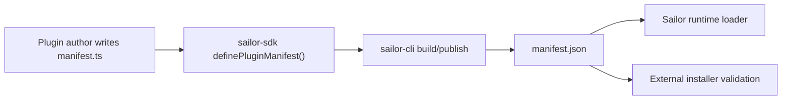

# Plugin Manifest TS Authoring Plan

**Goal:** Allow plugin authors to write a typed `manifest.ts` during development while keeping `manifest.json` as the runtime, publish, install, and validation artifact.

**Decision:** Do not make Sailor execute arbitrary `manifest.ts` from installed or external plugins. `manifest.ts` is source code for authors. `manifest.json` remains the portable artifact consumed by runtime, installer, marketplace validation, and preview flows.

---

## Architecture

- SDK owns typing helpers.
- CLI owns compilation from TypeScript source to JSON artifact.
- Runtime keeps loading JSON only.
- Plugin packages can gradually migrate without forcing existing built plugins to change.



---

## Phase 1: SDK Helper

- [x] Add `definePluginManifest()` to `sailor-sdk`.
- [x] Reuse the existing manifest schema/type shape.
- [x] Keep helper as a typed identity function.
- [x] Export the manifest type used by the helper.
- [x] Add SDK tests proving typed manifest authoring uses the exported manifest type.

Expected authoring shape:

```ts
import { definePluginManifest } from '@sailor/sdk'

export default definePluginManifest({
  id: 'example-plugin',
  name: 'Example Plugin',
  version: '1.0.0',
  // ...
})
```

---

## Phase 2: CLI Build Support

- [x] Teach `sailor-cli` to detect `manifest.ts`.
- [x] Compile/evaluate only local source during trusted development commands.
- [x] Emit normalized `manifest.json` into the build output.
- [x] Validate emitted JSON with the current JSON schema.
- [x] Fail build if both `manifest.ts` and `manifest.json` conflict.
- [x] Keep `manifest.json` support for existing plugins.

Guardrail: CLI may process `manifest.ts` in local development/build context only. Runtime and installer must not execute TypeScript from downloaded plugin packages.

---

## Phase 3: Runtime Compatibility

- [x] Keep backend plugin runtime loading `manifest.json`.
- [x] Keep external installer validating `manifest.json`.
- [x] Keep marketplace/package preview reading `manifest.json`.
- [x] Add clear error when a package only contains `manifest.ts` without built `manifest.json`.

Guardrail: installed plugin packages are data plus plugin runtime entrypoints. Manifest parsing must stay deterministic and schema-validated.

---

## Phase 4: Migration

- [x] Update plugin template to generate `manifest.ts`.
- [x] Update plugin docs with `manifest.ts` as the preferred source.
- [x] Update publish/build docs to explain that `manifest.json` is generated.
- [x] Migrate internal source plugins one by one only if their source folders are still maintained.
- [x] Keep built plugins runtime-safe by adding `manifest.ts` beside `manifest.json` without removing the JSON artifact.

---

## Verification

- [x] SDK tests pass.
- [x] CLI build produces the expected manifest JSON artifact from `manifest.ts`.
- [x] Runtime loads generated `manifest.json`.
- [x] External installer rejects packages missing `manifest.json`.
- [x] Existing built plugins continue working unchanged.

## Progress 2026-06-09

- Implemented in `C:\Workspace\Projects\sailor-sdk`:
  - `definePluginManifest()` exported from the SDK.
  - SDK tests, typecheck, and build passing.
- Published `@auvexis/sailor-sdk@2.0.1` to npm.
- Implemented in `C:\Workspace\Projects\sailor-cli`:
  - SDK dependency now points to the published `@auvexis/sailor-sdk@^2.0.1`.
  - Template now generates `src/manifest.ts`.
  - Build/release materializes validated `src/manifest.json` from compiled `dist/manifest.js`.
  - Conflict detection when `manifest.ts` and `manifest.json` drift.
  - CLI tests and build passing.
- Implemented in `C:\Workspace\Projects\sailor`:
  - Internal plugin folders now include typed `manifest.ts` sources next to existing `manifest.json` artifacts.
  - Added a server contract test to enforce `manifest.ts` coverage for internal plugin manifests.
  - Server dependency updated to `@auvexis/sailor-sdk@^2.0.1`.
