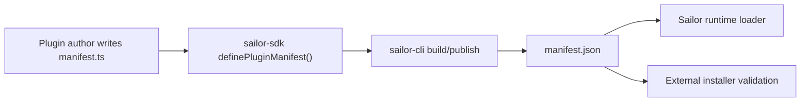

# Plugin Manifest TS Authoring Plan

**Goal:** Allow plugin authors to write a typed `manifest.ts` during development while keeping `manifest.json` as the runtime, publish, install, and validation artifact.

**Decision:** Do not make Sailor execute arbitrary `manifest.ts` from installed or external plugins. `manifest.ts` is source code for authors. `manifest.json` remains the portable artifact consumed by runtime, installer, marketplace validation, and preview flows.

---

## Architecture

- SDK owns typing helpers.
- CLI owns compilation from TypeScript source to JSON artifact.
- Runtime keeps loading JSON only.
- Plugin packages can gradually migrate without forcing existing built plugins to change.



---

## Phase 1: SDK Helper

- [ ] Add `definePluginManifest()` to `sailor-sdk`.
- [ ] Reuse the existing manifest schema/type shape.
- [ ] Keep helper as a typed identity function.
- [ ] Export the manifest type used by the helper.
- [ ] Add SDK tests proving invalid manifest fields fail type checks where possible.

Expected authoring shape:

```ts
import { definePluginManifest } from '@sailor/sdk'

export default definePluginManifest({
  id: 'example-plugin',
  name: 'Example Plugin',
  version: '1.0.0',
  // ...
})
```

---

## Phase 2: CLI Build Support

- [ ] Teach `sailor-cli` to detect `manifest.ts`.
- [ ] Compile/evaluate only local source during trusted development commands.
- [ ] Emit normalized `manifest.json` into the build output.
- [ ] Validate emitted JSON with the current JSON schema.
- [ ] Fail build if both `manifest.ts` and `manifest.json` conflict.
- [ ] Keep `manifest.json` support for existing plugins.

Guardrail: CLI may process `manifest.ts` in local development/build context only. Runtime and installer must not execute TypeScript from downloaded plugin packages.

---

## Phase 3: Runtime Compatibility

- [ ] Keep backend plugin runtime loading `manifest.json`.
- [ ] Keep external installer validating `manifest.json`.
- [ ] Keep marketplace/package preview reading `manifest.json`.
- [ ] Add clear error when a package only contains `manifest.ts` without built `manifest.json`.

Guardrail: installed plugin packages are data plus plugin runtime entrypoints. Manifest parsing must stay deterministic and schema-validated.

---

## Phase 4: Migration

- [ ] Update plugin template to generate `manifest.ts`.
- [ ] Update plugin docs with `manifest.ts` as the preferred source.
- [ ] Update publish/build docs to explain that `manifest.json` is generated.
- [ ] Migrate internal source plugins one by one only if their source folders are still maintained.
- [ ] Do not rewrite already built plugins under `server/src/plugins/` unless their source-of-truth moves back into active development.

---

## Verification

- [ ] SDK tests pass.
- [ ] CLI build produces the same manifest JSON shape as before.
- [ ] Runtime loads generated `manifest.json`.
- [ ] External installer rejects packages missing `manifest.json`.
- [ ] Existing built plugins continue working unchanged.
