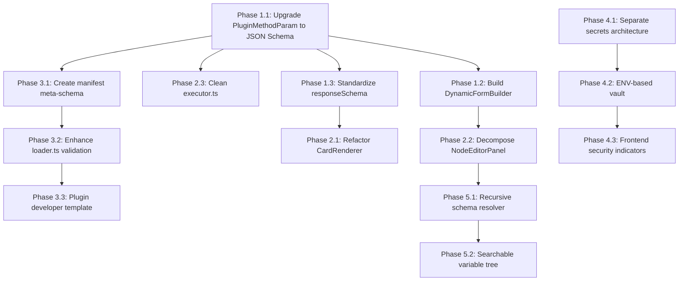

# Forge V2: Generic Plugin Ecosystem — Implementation Plan

## What is Forge?

Forge is a full-stack automation platform built with **React Router v7** (client) and **Fastify** (server). It provides:

1. **Plugin System** — A modular architecture where each integration (Google Drive, YouTube, etc.) is a self-contained plugin with its own auth, methods, and manifest.
2. **Workflow Engine** — A DAG-based visual editor where users connect plugin actions, code blocks, conditional branches, and loops into executable pipelines.
3. **Explorer** — A graph-based visualization of all loaded plugins and their relationships.

The platform currently ships with 2 first-party plugins (`google-drive`, `google-youtube`) and supports OAuth2, API Key, and No-Auth credential flows.

---

## Current Architecture (As-Is)

### Server (`server/src/`)

| Layer | File | Purpose |
|-------|------|---------|
| **Plugin Loader** | `core/modules/plugins/loader.ts` | Recursively scans `src/plugins/` for `index.ts` files, validates required fields (`id`, `manifest`, `auth`, `methods`), registers into `PluginManager` |
| **Plugin Manager** | `core/modules/plugins/manager.ts` | In-memory `Map<string, ForgePlugin>` registry. Provides `getPlugin()`, `getPlugins()`, `registerPlugin()` |
| **Plugin Executor** | `core/modules/plugins/executor.ts` | Resolves credentials/tokens, auto-refreshes OAuth2, "cooks" params (Buffer→base64, file object extraction), calls the plugin method |
| **Credential Store** | `core/modules/plugins/credential-store.ts` | SQLite-backed storage for credentials and OAuth2 tokens. Provides masking for frontend display |
| **Workflow Engine** | `core/modules/workflows/executor.ts` | Topological-sort DAG executor. Handles `plugin`, `code`, `if`, `loop`, `subworkflow` node types with retry policies |
| **Workflow Parser** | `core/modules/workflows/parser.ts` | Template interpolation engine (`{{ steps.x.output.y }}`) that preserves object references (Buffers) |
| **Code Runner** | `core/modules/workflows/code-runner.ts` | VM2-sandboxed JavaScript execution with captured console logs |
| **Workflow Repository** | `core/modules/workflows/repository.ts` | SQLite CRUD for workflows and execution logs, with migration support for legacy formats |
| **Routes** | `core/routes/plugins.routes.ts` | REST API: CRUD credentials, execute methods, OAuth2 connect/callback |
| **Routes** | `core/routes/workflows.routes.ts` | REST API: CRUD workflows, execute, get logs |

### Plugin Contract (`shared/models/plugin-types.ts`)

```typescript
interface ForgePlugin {
  id: string;
  manifest: PluginManifest;          // metadata + methods schema
  auth: CredentialProvider;           // oauth2 | api_key | none
  methods: Record<string, (params, context?) => Promise<any>>;
}
```

### Plugin Manifest (Example: `google-drive/manifest.json`)

Each method declares `parameters`, `responseSchema`, and `ui` hints:
- **parameters**: `{ type, inputType, required, isBase64 }` — custom format, NOT JSON Schema
- **responseSchema**: Loose JSON-Schema-like with custom `x-type` field and `label` property
- **ui**: `{ component: "table"|"card", actions: [...], download: {...} }`

### Client (`client/app/`)

| Layer | Key Files | Purpose |
|-------|-----------|---------|
| **State** | `providers/ForgeProvider.tsx` | Global context: plugins cache, active plugin state, OAuth flow, view routing |
| **Plugin Types** | `modules/forge/plugins/types/plugin.ts` | Client-side mirror of server types. Hardcodes `x-type: "file"|"folder"|"text"` and `component: "table"|"card"|"text"` |
| **Renderers** | `plugins/renderers/CardRenderer.tsx` | Renders responses — branches on `x-type` with separate JSX blocks for "file", "folder", "text" |
| **Renderers** | `plugins/renderers/TableRenderer.tsx` | Table view for array responses |
| **Node Editor** | `workflows/components/NodeEditorPanel.tsx` | 1089-line monolith that manually branches into trigger/plugin/code/if/loop/subworkflow editors |
| **Workflow Editor** | `workflows/components/WorkflowEditor.tsx` | ReactFlow-based DAG editor with node CRUD, edge management, save/execute |

---

## Identified Problems

### Problem 1: Parameter Schema is Not JSON Schema
**Location**: `manifest.json` → `parameters` block, `plugin-types.ts` → `PluginMethodParam`

The current parameter format (`{ type, inputType, required, isBase64 }`) is a custom micro-format. It cannot express:
- Enumerations (`enum`)
- Nested objects or arrays of objects
- Conditional fields (`if/then/else`)
- Min/max constraints, patterns, defaults
- Descriptions or examples

This forces the `NodeEditorPanel` to render only `<Input>` fields for every parameter, regardless of what the plugin actually needs.

### Problem 2: `x-type` Hardcoding in CardRenderer
**Location**: `CardRenderer.tsx` lines 73, 144, 202

The renderer explicitly checks `schema["x-type"] === "file"`, `"folder"`, `"text"` and renders completely different JSX trees for each. A new plugin returning weather data, financial charts, or audio files has no rendering path.

### Problem 3: NodeEditorPanel is a 1089-line Monolith
**Location**: `NodeEditorPanel.tsx`

Contains 6 inline sub-editors (trigger, plugin, code, if, loop, subworkflow) all in one file. Adding a new node type requires modifying this file, violating open-closed principle.

### Problem 4: Credential Secrets Stored in User SQLite
**Location**: `credential-store.ts`

OAuth2 `client_secret` values are stored as plaintext JSON in a local SQLite database. In a multi-tenant or shared deployment, this is a security concern. There is no separation between "instance-level secrets" (configured by the admin) and "user-level tokens" (obtained via OAuth flow).

### Problem 5: Variable Mapper Only Inspects One Level
**Location**: `NodeEditorPanel.tsx` lines 585-627

The upstream variable mapper checks `responseSchema.properties` or `responseSchema.items.properties` but doesn't recurse deeper. For a response like `{ download: { content: Buffer, fileName: string } }`, the user cannot directly map `steps.x.output.download.fileName`.

---

## Implementation Plan

### Phase 1: JSON Schema-First Parameter System

#### 1.1 Upgrade `PluginMethodParam` to JSON Schema

**Files to modify:**
- `server/src/shared/models/plugin-types.ts` — Replace `PluginMethodParam` with standard JSON Schema
- `server/src/plugins/forge/google-drive/manifest.json` — Migrate parameters
- `server/src/plugins/forge/google-youtube/manifest.json` — Migrate parameters

**Current format:**
```json
"pageSize": {
  "type": "number",
  "inputType": "number",
  "required": false,
  "isBase64": false
}
```

**Target format (JSON Schema Draft 7):**
```json
"parameters": {
  "type": "object",
  "properties": {
    "pageSize": {
      "type": "integer",
      "description": "Number of results per page",
      "default": 10,
      "minimum": 1,
      "maximum": 100,
      "x-input-type": "number"
    },
    "content": {
      "type": "string",
      "format": "binary",
      "description": "File content to upload",
      "x-input-type": "file"
    }
  },
  "required": ["fileId"]
}
```

**Migration strategy:**
- Keep `x-input-type` as a Forge-specific extension for UI hints (replaces `inputType`)
- Move `required` from per-field to the schema-level `required` array (standard JSON Schema)
- Replace `isBase64` with `"format": "binary"` or `"format": "base64"`
- Add `description`, `default`, `enum`, `minimum`, `maximum` where appropriate

**Server impact:**
- `executor.ts` line 64-92: The param "cooking" logic checks `paramConfig.isBase64`. Refactor to check `paramConfig.format === "base64"` instead
- `loader.ts`: Add optional JSON Schema validation of manifest during plugin load
- `plugins.routes.ts`: No changes needed — the execute endpoint is already generic

#### 1.2 Build `DynamicFormBuilder` Component (Client)

**New file:** `client/app/components/forge/DynamicFormBuilder.tsx`

A recursive component that reads a JSON Schema `properties` object and renders:

| JSON Schema type | `x-input-type` | Rendered Widget |
|-----------------|-----------------|-----------------|
| `string` | `text` (default) | `<Input type="text">` |
| `string` | `password` | `<Input type="password">` |
| `string` | `file` | `<FileDropzone>` |
| `string` + `enum` | — | `<Combobox>` with enum values |
| `string` + `format: "uri"` | — | `<Input type="url">` |
| `integer` / `number` | — | `<Input type="number">` with min/max |
| `boolean` | — | `<Switch>` or `<Checkbox>` |
| `object` | — | Nested fieldset (recursive) |
| `array` + `items` | — | Repeatable field group with Add/Remove |

**Integration point:** Replace the manual parameter rendering in `NodeEditorPanel.tsx` lines 475-648 with:
```tsx
<DynamicFormBuilder
  schema={selectedAction.parameters}
  values={data.params || {}}
  onChange={(newParams) => updateNodeData({ params: newParams })}
  upstreamNodes={upstreamNodes}
  onInjectVariable={injectVariable}
/>
```

#### 1.3 Standardize Response Schema

**Current:** `responseSchema` uses a mix of JSON Schema and custom extensions (`x-type`, `label`).

**Target:** Keep JSON Schema as the base, formalize extensions:
- `x-type` → rename to `x-forge-display` with values: `"file"`, `"folder"`, `"media"`, `"text"`, `"generic"` (default)
- `label` on properties → keep as `x-label` (non-standard but useful for UI)
- Add `x-forge-icon` for custom icon hints

This makes `CardRenderer` data-driven instead of hardcoded.

---

### Phase 2: Remove Hardcoded Type Checks

#### 2.1 Refactor `CardRenderer.tsx` — Eliminate `x-type` Branching

**Current:** 3 nearly identical JSX blocks for `file`, `folder`, `text` (lines 73-271).

**Target:** Single generic renderer that:
1. Reads `schema["x-forge-display"]` to select an icon strategy (not a whole JSX tree)
2. Uses the same property-display loop for ALL types
3. Falls back to a generic "key: value" card for unknown types

```tsx
// Pseudocode for unified CardRenderer
const iconStrategy = getIconForDisplay(schema["x-forge-display"], data);

return (
  <div className="flex gap-5">
    <div className="icon-zone">{iconStrategy}</div>
    <div className="content-zone">
      {entries.map(([key, val]) => <PropertyRow key={key} ... />)}
      {ui.actions && <ActionBar actions={ui.actions} ... />}
    </div>
  </div>
);
```

#### 2.2 Decompose `NodeEditorPanel.tsx` — Extract Sub-Editors

**Current:** 1089 lines with 6 inline render functions.

**Target structure:**
```
workflows/components/node-editors/
├── TriggerEditor.tsx        (extracted from renderTriggerEditor)
├── PluginEditor.tsx          (extracted from renderPluginEditor)  
├── CodeEditor.tsx            (extracted from renderCodeEditor)
├── IfEditor.tsx              (extracted from renderIfEditor)
├── LoopEditor.tsx            (extracted from renderLoopEditor)
├── SubWorkflowEditor.tsx     (extracted from renderSubWorkflowEditor)
└── index.ts                  (registry: nodeType → EditorComponent)
```

**NodeEditorPanel becomes a thin shell:**
```tsx
const EditorComponent = NODE_EDITOR_REGISTRY[dataType];
return EditorComponent ? <EditorComponent {...sharedProps} /> : null;
```

This also makes the system extensible: future node types just add an entry to the registry.

#### 2.3 Clean `executor.ts` — Remove File-Object Heuristics

**Current:** Lines 68-84 contain "magic extraction" logic that checks for `value.content` inside objects. This is a Google Drive-specific pattern baked into the generic executor.

**Target:** Move this logic to the plugin's own method or into a declared `x-forge-transform` in the manifest. The executor should ONLY do:
1. Resolve credentials/tokens
2. Validate params against schema (optional)
3. Call the method
4. Return the result

---

### Phase 3: Standardized Manifest & Developer Onboarding

#### 3.1 Create `ForgePluginManifest` JSON Schema

**New file:** `server/src/shared/schemas/forge-manifest.schema.json`

A meta-schema that validates any plugin's `manifest.json`:
- Enforces required metadata fields (`id`, `name`, `version`, `author`, `category`)
- Validates that each method has `parameters` (JSON Schema), `responseSchema`, and `metadata`
- Validates `ui` hints against allowed component types

#### 3.2 Enhance `loader.ts` with Schema Validation

```typescript
import manifestSchema from "../../shared/schemas/forge-manifest.schema.json";
import Ajv from "ajv";

const ajv = new Ajv();
const validateManifest = ajv.compile(manifestSchema);

// In loadRecursively:
if (!validateManifest(plugin.manifest)) {
  throw new Error(`Invalid manifest: ${JSON.stringify(validateManifest.errors)}`);
}
```

#### 3.3 Plugin Developer Template

**New directory:** `server/src/plugins/_template/`

A minimal, documented example plugin that a developer can copy:
```
_template/
├── index.ts          (ForgePlugin definition)
├── manifest.json     (valid against meta-schema)
├── methods.ts        (method implementations)
└── README.md         (developer guide)
```

---

### Phase 4: Secure Credential Vault

#### 4.1 Separate Instance Secrets from User Tokens

**Current:** Both `client_id`/`client_secret` AND `access_token`/`refresh_token` live in the same SQLite database.

**Target architecture:**

| Secret Type | Storage | Access Pattern |
|------------|---------|----------------|
| **Instance Secrets** (client_id, client_secret, api_keys) | Environment variables via `.env` file | Read at startup, never sent to frontend |
| **User Tokens** (OAuth2 access/refresh tokens) | SQLite `plugin_tokens` table (encrypted at rest) | Read during execution, auto-refreshed |

#### 4.2 ENV-Based Credential Resolution

**New file:** `server/src/core/modules/plugins/vault.ts`

```typescript
export const Vault = {
  getInstanceSecret(pluginId: string, key: string): string | undefined {
    // Pattern: FORGE_PLUGIN_{PLUGIN_ID}_{KEY}
    const envKey = `FORGE_PLUGIN_${pluginId.toUpperCase().replace(/-/g, '_')}_${key.toUpperCase()}`;
    return process.env[envKey];
  },

  getInstanceSecrets(pluginId: string, schema: CredentialSchema): Record<string, string> {
    const secrets: Record<string, string> = {};
    for (const key of Object.keys(schema)) {
      const value = this.getInstanceSecret(pluginId, key);
      if (value) secrets[key] = value;
    }
    return secrets;
  }
};
```

**Migration path:**
1. `credential-store.ts` → Check ENV first, fall back to SQLite
2. `plugins.routes.ts` `/credentials` endpoint → Refuse to store fields that are already in ENV
3. Frontend `PluginMenuAuth` → Show "Configured via environment" badge for ENV-provided fields

#### 4.3 Frontend Security Indicators

Update `PluginMenuAuth.tsx` to show:
- 🔒 **Locked** badge for fields provided via ENV (non-editable)
- ✏️ **User-configured** badge for fields in SQLite
- This prevents accidental exposure of admin-level secrets

---

### Phase 5: Intelligent Variable Mapping (Recursive Schema Tree)

#### 5.1 Build Recursive Schema Resolver

**New file:** `client/app/modules/forge/workflows/utils/schemaResolver.ts`

```typescript
interface SchemaPath {
  path: string;           // "steps.node1.output.download.fileName"
  label: string;          // "Download → File Name"
  type: string;           // "string"
  sourceNodeName: string; // "Get File"
}

export function resolveSchemaTree(
  nodeId: string,
  nodeName: string,
  schema: any,
  prefix = `steps.${nodeId}.output`,
  labelPrefix = "",
): SchemaPath[] {
  // Recursively traverse schema.properties
  // For arrays, append [0] and traverse items.properties
  // Return flat list of all leaf paths
}
```

#### 5.2 Replace Flat Variable Buttons with Searchable Tree

**Current:** Flat buttons like `node1.output` with no depth.

**Target:** A searchable dropdown/combobox that shows the full variable tree:
```
┌─────────────────────────────┐
│ 🔍 Search variables...      │
├─────────────────────────────┤
│ 📥 trigger                  │
│   ├─ trigger.fileId         │
│   └─ trigger.query          │
│ 📦 Get File (node_1)        │
│   ├─ steps.node_1.output.id │
│   ├─ steps.node_1.output... │
│   └─ steps.node_1.output... │
│     └─ ...download.fileName │
└─────────────────────────────┘
```

---

## Execution Order & Dependencies



**Recommended order:**
1. Phase 1.1 (foundation — everything depends on this)
2. Phase 4.1 + 4.2 (security — independent, can be parallel)
3. Phase 1.2 + 1.3 (client components)
4. Phase 2.1 + 2.2 + 2.3 (cleanup)
5. Phase 3 (developer experience)
6. Phase 5 (quality of life)

---

## Key Files Reference

### Server — Must Modify
| File | Phase | Change |
|------|-------|--------|
| [plugin-types.ts](file:///c:/Workspace/Projects/forge/server/src/shared/models/plugin-types.ts) | 1.1 | Replace `PluginMethodParam` with JSON Schema reference |
| [executor.ts](file:///c:/Workspace/Projects/forge/server/src/core/modules/plugins/executor.ts) | 2.3 | Remove file-object heuristics, simplify to pure pipe |
| [loader.ts](file:///c:/Workspace/Projects/forge/server/src/core/modules/plugins/loader.ts) | 3.2 | Add Ajv schema validation |
| [credential-store.ts](file:///c:/Workspace/Projects/forge/server/src/core/modules/plugins/credential-store.ts) | 4.1, 4.2 | ENV fallback, encrypt tokens |
| [manifest.json (drive)](file:///c:/Workspace/Projects/forge/server/src/plugins/forge/google-drive/manifest.json) | 1.1 | Migrate parameters to JSON Schema |
| [manifest.json (youtube)](file:///c:/Workspace/Projects/forge/server/src/plugins/forge/google-youtube/manifest.json) | 1.1 | Migrate parameters to JSON Schema |

### Server — New Files
| File | Phase |
|------|-------|
| `shared/schemas/forge-manifest.schema.json` | 3.1 |
| `core/modules/plugins/vault.ts` | 4.2 |
| `plugins/_template/` | 3.3 |

### Client — Must Modify
| File | Phase | Change |
|------|-------|--------|
| [plugin.ts (types)](file:///c:/Workspace/Projects/forge/client/app/modules/forge/plugins/types/plugin.ts) | 1.1, 1.3 | Update parameter/response types |
| [CardRenderer.tsx](file:///c:/Workspace/Projects/forge/client/app/modules/forge/plugins/renderers/CardRenderer.tsx) | 2.1 | Eliminate `x-type` branching |
| [NodeEditorPanel.tsx](file:///c:/Workspace/Projects/forge/client/app/modules/forge/workflows/components/NodeEditorPanel.tsx) | 1.2, 2.2 | Replace inline editors with DynamicFormBuilder + registry |

### Client — New Files
| File | Phase |
|------|-------|
| `components/forge/DynamicFormBuilder.tsx` | 1.2 |
| `workflows/components/node-editors/*.tsx` | 2.2 |
| `workflows/utils/schemaResolver.ts` | 5.1 |

---

## Non-Breaking Constraints

1. **Backward compatibility**: The migration in `repository.ts` already handles legacy workflows. New schema format must coexist with old manifests during transition.
2. **No plugin breakage**: Existing `google-drive` and `google-youtube` plugins must continue working throughout all phases.
3. **Incremental deployment**: Each phase should be independently deployable and testable.
4. **Zero downtime**: The credential vault migration must handle the case where secrets exist in both ENV and SQLite gracefully (ENV takes precedence).
